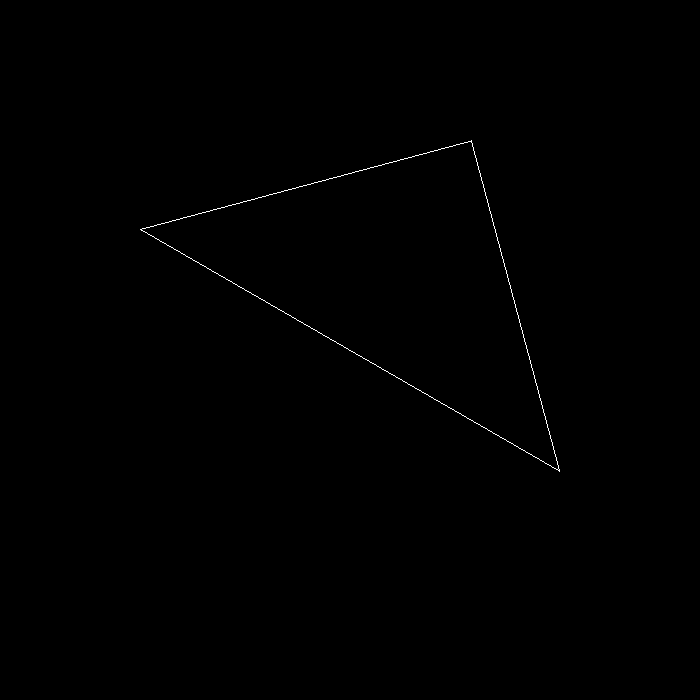

# GAMES101 homework1

## 完成
- 构建模型矩阵
- 构建透视投影矩阵
- 能看到变换后的三角形
- 按AD键，三角形能旋转
- bonus：绕任意过原点的轴的旋转变换矩阵

## 函数

### get_model_matrix(...)
- 模型矩阵

### get_projection_matrix(...)
- 透视投影矩阵

### get_rotation(...)
- 绕任意过原点的轴的旋转矩阵

## Result

### triangle

### rotated_triangle

