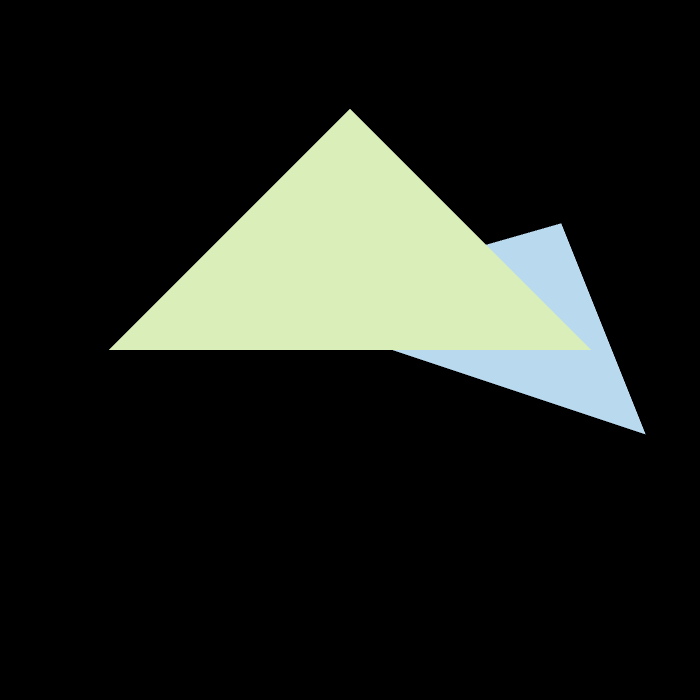

# GAMES101 homework2

## 完成
- 三角形栅格化算法
- 测试点是否在三角形内
- z-buffer算法，将三角形按顺序画在屏幕上
- bonus：用4x super-sampling处理Anti-aliasing

## 函数

### rasterize_triangle(...)
- 三角形栅格化函数
- No AA注释部分为“无反走样”算法实现
- With AA注释部分为“4x超采样”算法实现

## Result

### No Anti-aliasing

### With Anti-aliasing

