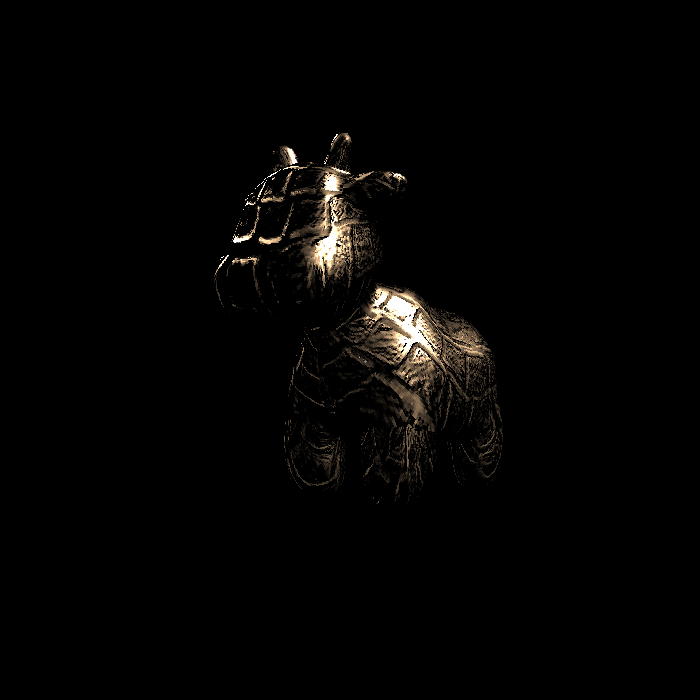

# GAMES101 homework3

## 完成
- 参数插值
- Blinn-phong 反射模型
-  Texture mapping
- Bump mapping 与 Displacement mapping
- Bonus: 双线性纹理插值

## 说明

### class Texture
- 由于模型贴图的uv有<0的情况，所以做了max(uv,0)的处理
### texture_fragment_shader(...)
- 此处最终代码为双线性插值实现

## Result

### bump

### displacement

### normal

### phong

### texture

### bilinear

### compare
