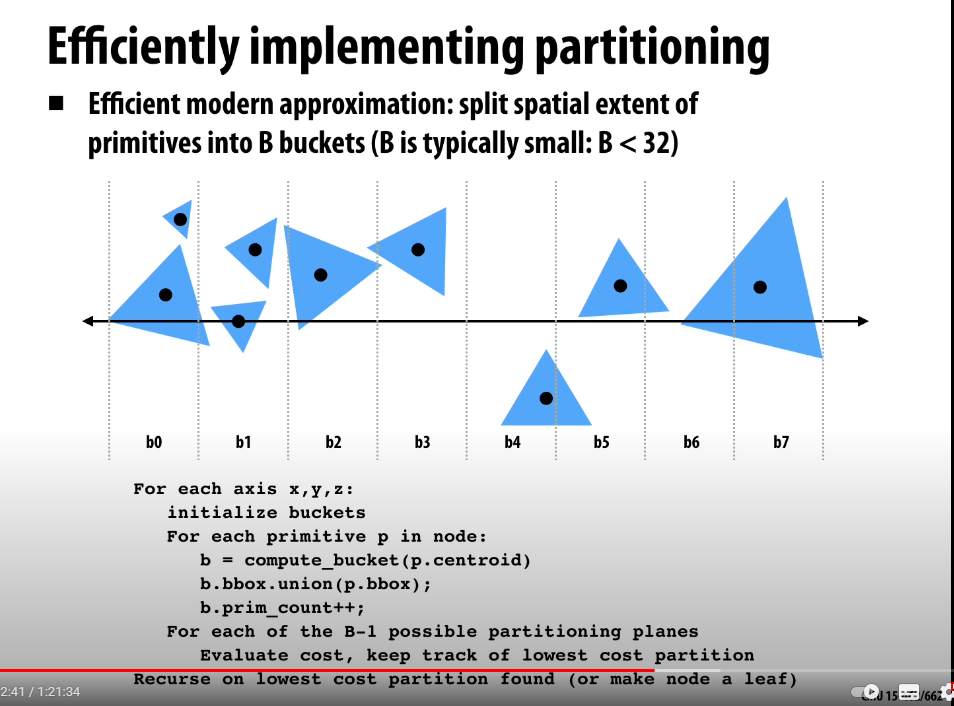
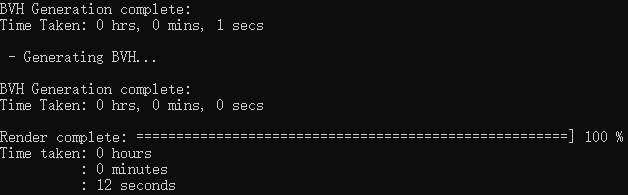
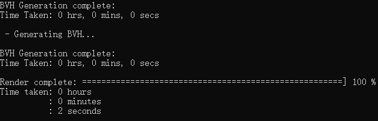
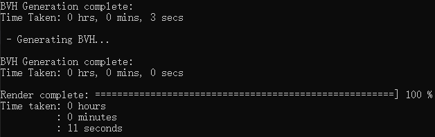
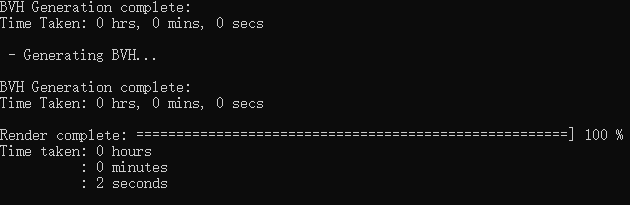
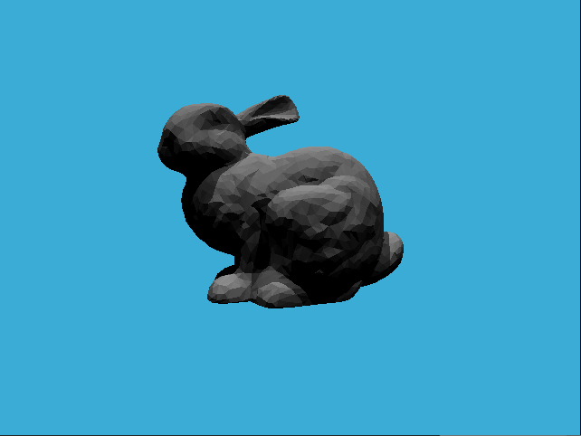

# GAMES101 homework6

## 完成

- 包围盒求交
- BVH查找
- SAH查找

## SAH实现

- 代价计算公式
  $$
  C=C_{trav}+\frac{S_A}{S_N}N_AC_{isect}+\frac{S_B}{S_N}N_BC_{isect}
  $$
  
- 将最长轴平均分为32份，得到32种划分左右子树的情况

  
- 计算每种情况的代价，最后取代价最小的情况

## Result

|                | Debug | Release |
| -------------- | ----- | ------- |
| BVH Generation | 1s    | 0s      |
| SAH Generation | 3s    | 0s      |

|            | Debug | Release |
| ---------- | ----- | ------- |
| BVH Render | 12s   | 2s      |
| SAH Render | 11s   | 2s      |

- BVH Debug

- BVH Release

- SAH Debug

- SAH Release

- BVH

- SAH
