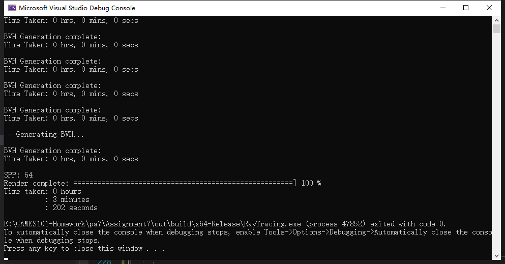
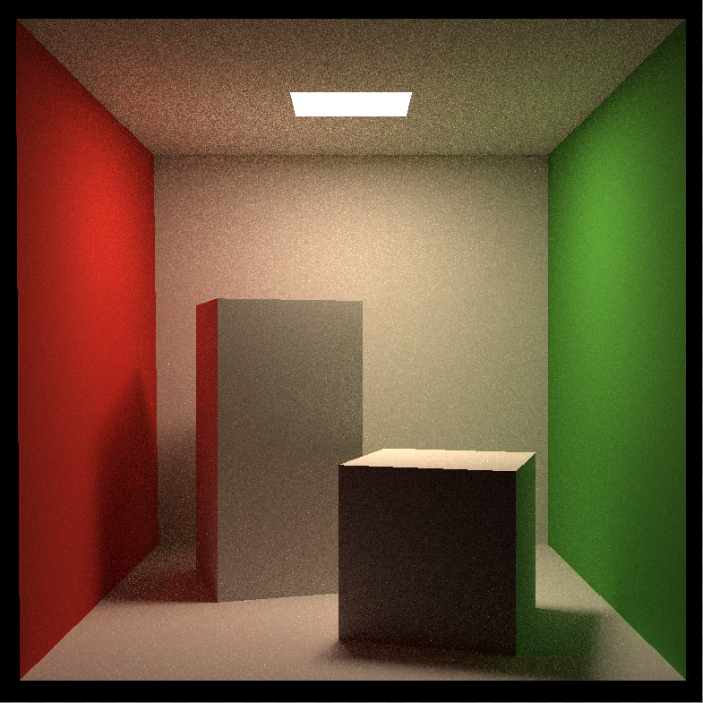
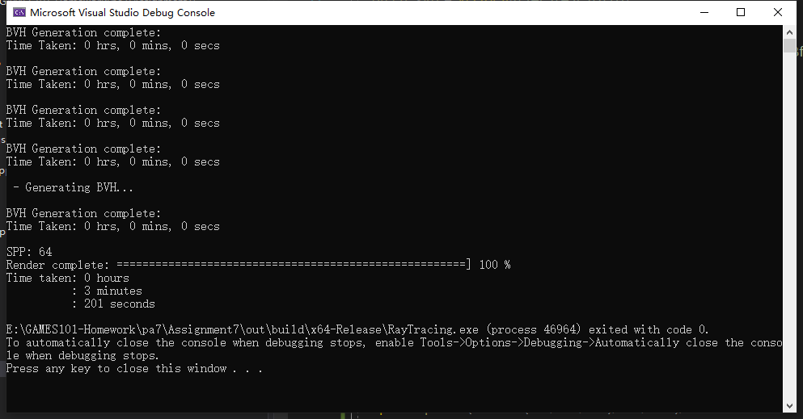
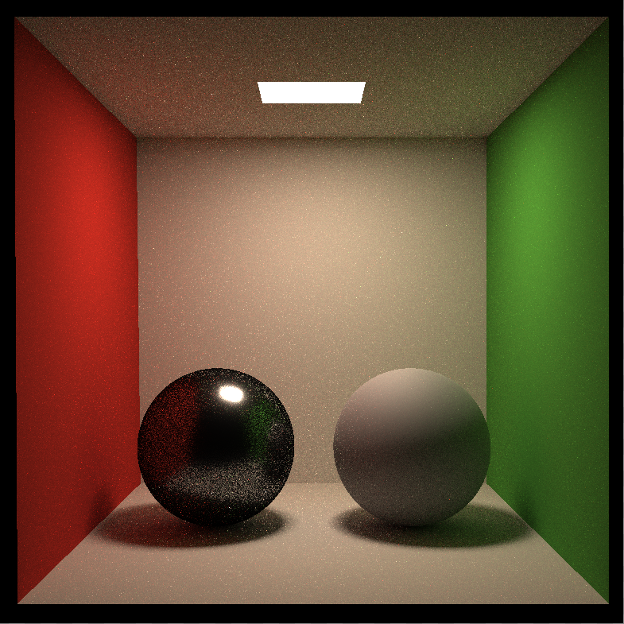

# GAMES101 homework7

## 完成

- Path Tracing
- 多线程
- Microfacet

## 说明

- 分辨率：784*784
- 采样数：64
- 计算时间：

  - CornellBox：202秒

  - Microfacet：201秒
- 多线程：
  - 使用OpenMP实现
  - 修改了Renderer::Render()和UpdateProgress()函数
  - #pragma omp parallel for 分配多线程任务
  - #pragma omp critical 临界区，控制打印进度
- Microfacet：
  - main函数中指定材质参数：
    - Kd = metallic为0时的$$F_0$$
    - metallic = 金属度，分别取0.9、0.1
    - roughness = 粗糙度，分别取0.1、0.9
  - main函数中使用Sphere替换原来的Box
  - Material.hpp中定义了MICROFACET类型材质，
  - Material::eval()函数实现了Microfacet BRDF，使用了如下函数：
    - DistributionGGX
    - GeometrySmith
    - fresnelSchlick

## Result

- Cornell Box
  

  
  
  
  
  
  
  
  

- Microfacet
  

  
  
  

