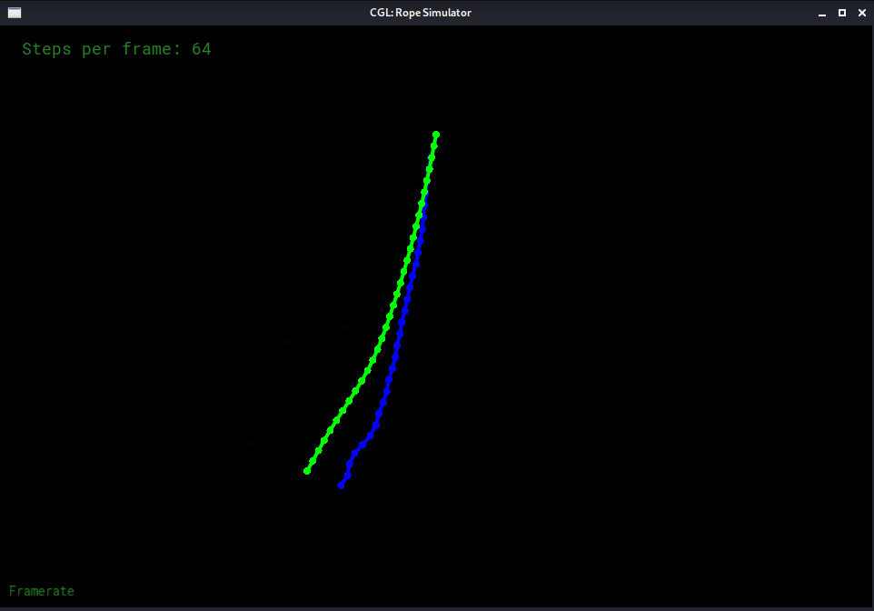
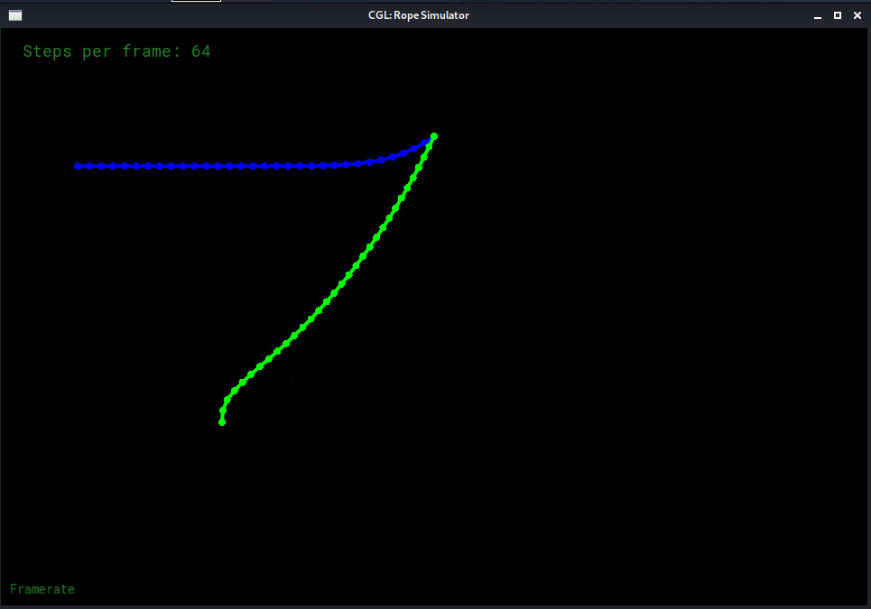

# GAMES101 homework8

## 完成
- 连接绳子约束，正确的构造绳子
- 半隐式欧拉法
- 显式欧拉法
- 显式 Verlet
- 阻尼

## 函数

### Rope::rope(...)
- 创建弹簧
- 创建质点
- 分配质点给弹簧
- 设置固定质点

### Rope::simulateEuler(...)
- 带阻尼的半隐式欧拉法，阻尼系数0.01
- 带阻尼的显式欧拉法，阻尼系数6.5，已注释

### Rope::simulateVerlet(...)
- 带阻尼的显式Verlet，阻尼系数0.0001

## Result

### semi_implicit_euler & verlet

### explicit_euler & verlet

